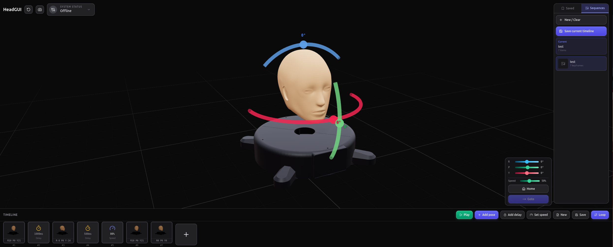

<h1 align="center">HeadGUI</h1>
<p align="center">
  
</p>

<p align="center">
  <strong>Robot Head Controller</strong> — 3D pose control, timeline sequences &amp; serial/USB hardware interface
</p>
<p align="center">
  React · TypeScript · Electron · Three.js · Vite
</p>

---

## Table of contents

- [Table of contents](#table-of-contents)
- [Prerequisites](#prerequisites)
- [Installation](#installation)
- [Running the app](#running-the-app)
  - [1. In the browser (local)](#1-in-the-browser-local)
  - [2. In the browser (remote access via IP)](#2-in-the-browser-remote-access-via-ip)
  - [3. As a desktop app (Electron)](#3-as-a-desktop-app-electron)

---

## Prerequisites

- **Node.js** 14.19.0+ and **npm** (this branch `v14` is for Node 14; use `main` for Node 18+). If install fails due to engine, use `npm install --ignore-engines`.
- **Linux / Windows / macOS** for running and building

---

## Installation

Clone the repo and install dependencies:

```bash
git clone https://github.com/botforge-robotics/HeadGUI.git
cd HeadGUI
git checkout v14
npm install
```

**Node 14 (v14 branch) notes:**

- If npm says *"package-lock.json was generated for lockfileVersion@3"*, the lockfile was created with a newer npm. Regenerate a Node‑14–compatible lockfile with Node 14 active:
  ```bash
  nvm use 14.19.0   # or your Node 14
  rm package-lock.json && npm install
  ```
- Warnings about **three-mesh-bvh@0.7.8** and **tar** come from transitive dependencies (@react-three/drei and others). They are safe to ignore on this branch; fixing them would require newer tooling than Node 14 provides.

---

## Running the app

### 1. In the browser (local)

Runs the Vite dev server; open **http://localhost:5173** on the same machine.

```bash
npm run dev
```

---

### 2. In the browser (remote access via IP)

Run the dev server bound to all interfaces so other devices on your network can open the UI by IP.

```bash
npm run dev:remote
```

Then:

1. Note your machine’s IP (e.g. `192.168.1.100` on Linux: `ip addr` or `hostname -I`; on Windows: `ipconfig`).
2. On another device (phone, tablet, another PC) on the **same network**, open:
   ```text
   http://<YOUR_IP>:5173
   ```
   Example: `http://192.168.1.100:5173`

**Raspberry Pi / low-resource:** To avoid file watching (reduces CPU and inotify load), use:

- Local: `npm run dev:pi`
- Remote: `npm run dev:remote:pi`
  No hot-reload; restart the server to pick up code changes.

---

### 3. As a desktop app (Electron)

Starts the Vite dev server and opens the app in an Electron window (full desktop experience and serial/USB support).

```bash
npm run electron:dev
```

---

<p align="center">
  <sub>HeadGUI · Robot Head Controller</sub>
</p>
